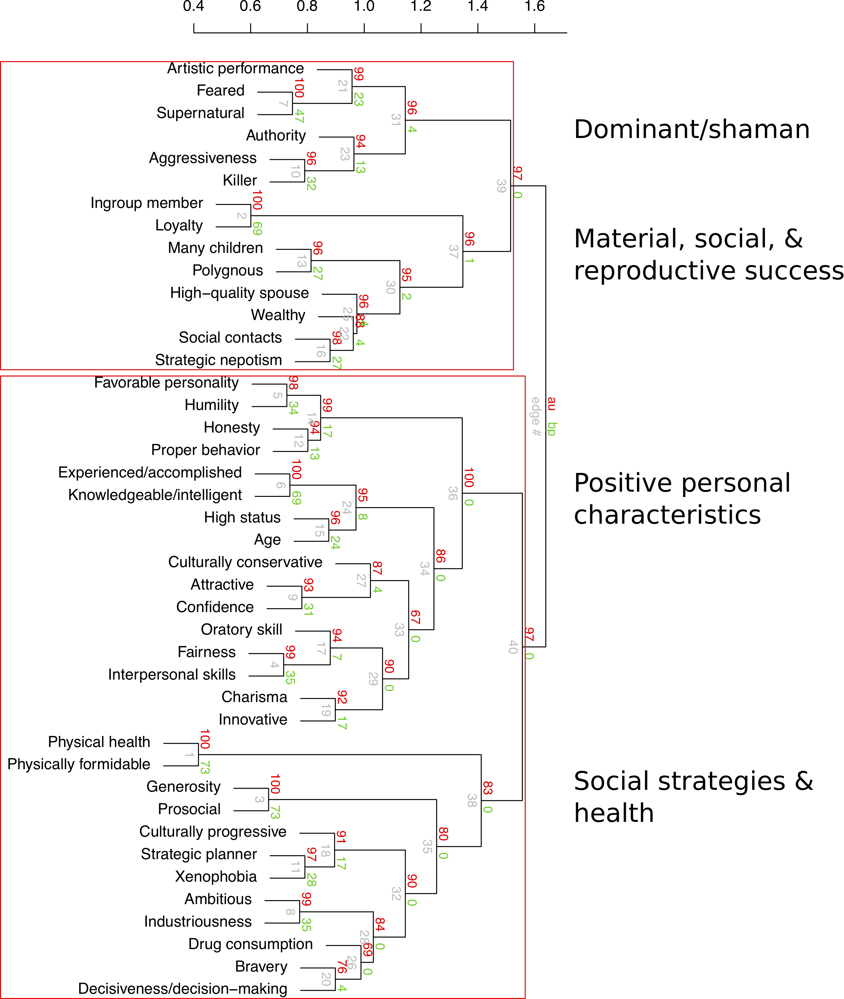
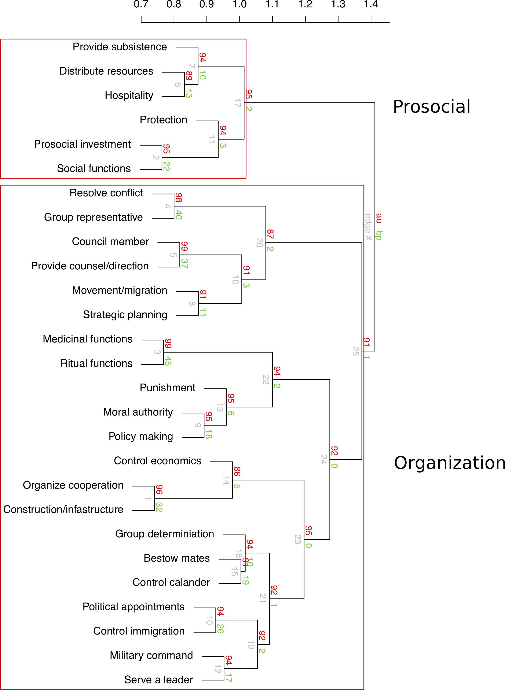

```{r setup, include=FALSE}
knitr::opts_chunk$set(echo = FALSE, warning=FALSE, message=F)
source('analyses2.R')
library(pander)
```


<!-- A thematic note: One of our primary goals is to explore how an evolutionary framework can illuminate when we expect to find cultural, behavioral, physiological, etc. variation and then explain (some of) that variation. Part of going "Beyond WEIRD" is getting to theories that can account for population-level variation and predict invariant universals (or, at least, less variable phenotypes). We want to push things beyond the 'butterfly collecting' of simply documenting population-level variation. -->


# Abstract

Leader-follower dynamics are central to much of social life. Processes of leadership and followership observed in traditional societies, especially among small-scale societies, are often quite distinct from those observed among WEIRD societies and their complex organizations. Many researchers have turned to evolutionary theory to integrate diverse perspectives on human leadership and to better understand the diversity of leadership and followership observed across human cultures and across social contexts. Evolutionary theories of leadership, in turn, draw on ethnographic case studies from traditional societies that are thought to more closely resemble the small, face-to-face societies in which humans evolved. Currently, though, there is limited systematic data on the nature of leadership in such societies.

We build on our previous cross-cultural findings to systematically review the nature of leadership across the full range of human cultural diversity. Over 1200 ethnographic texts from the Human Relations Area Files (HRAF) were coded on leader qualities, their functions, and the costs and benefits for both leaders and followers across diverse social contexts. We discovered evidence for both cultural universals in leadership, as well as important variation, especially when compared to leadership in WEIRD societies. Across all contexts, leaders in the ethnographic record are most commonly described as intelligent and knowledgeable, of high social status, accomplished, wealthy, and prosocial. The primary benefits leaders offer to followers are resolving conflicts, organizing cooperation, providing social functions, leading in inter-group conflicts, providing ritual services, and distributing resources. The primary benefits leaders receive from followers include non-food resources, increased social status, and social services from followers. The most frequent costs of leadership for leaders include loss of social status and resources, and increased risk of harm or conflict. For followers, the most frequent costs include loss of resources, costs in providing social services, and increased risk of harm or conflict.

Leadership in WEIRD settings often differs substantially from non-WEIRD settings. In WEIRD settings influence often extends into multiple domains, organizations are more hierarchical, and interactions between leaders and followers are less frequently face-to-face. A detailed view of leaders, their roles, and the costs and benefits of leadership across traditional societies and across contexts stands to make a significant empirical contribution for the development of more integrative evolutionary theories of leadership and social hierarchy.

# Introduction

>It's good to be king, if just for a while. - Tom Petty

Across human societies, the influence of leaders stands to substantially shape the nature of group structure and group outcomes. Simultaneously, social norms, pressures from competing leaders or rival or cooperative groups, and followers preferences can greatly constrain a leader's agenda. The interactions between the strategies of individual leaders, pressures of followership, and group dynamics are likely to strongly contribute to organizational variation across human populations including social and economic trajectories [@wiessner_risk_1982] and cultural evolutionary processes [@henrich_big_2015]. 

Leadership and followership are critical in understanding group structure and have been the focus of much scientific attention across psychology, sociology, political science, and managerial studies. Until recently, this very large body of work was relatively disconnected from approaches to leadership in anthropology and biology. Under a unifying evolutionary framework, social and biological scientists have now produced a sizable body of theory on the evolution and cross-cultural patterning of leadership and followership [e.g., @henrich_big_2015; @richerson_tribal_2009; @van_vugt_evolutionary_2006; @pietraszewski_evolution_2019; @hooper_theory_2010; @kaplan_evolutionary_2009; @von_rueden_roots_2014], accompanied by a growing body of empirical results [e.g., @bowser_womens_2010; @cheng_two_2013; @garfield_investigating_2019; @garfield_evolutionary_2019; @von_rueden_leadership_2014; @von_rueden_sex_2018; @smith_leadership_2016]. This integration as been informative. Drawing on the study of leadership in evolutionary perspective and across diverse, small-scale and traditional societies can help develop more generalizable theories and offer applications to shape organizational structure in ways which are more consistent with human evolutionary history and evolved leader-follower psychologies [@von_rueden_leadership_2015; @garfield_review_2019]. Nonetheless, much of this work has focused on community or political leaders, often overlooking the nature of leadership and followership across social domains and at all levels of social organization. Moreover, while the benefits leaders accrue for their services have received substantial attention the costs of leadership for both leaders and followers have also been relatively under-investigated. Current outstanding questions for evolutionary leadership scholars include the degree to which the nature of leadership is shaped by population-level variation and the costs and benefits leaders and followers incur across distinct leadership systems. 

Evolutionary scholars typically define leaders as individuals who maintain disproportionate influence over decision-making within groups [@von_rueden_leadership_2015], whatever the group may be. Leadership roles are also often associated with specific rights and responsibilities. Not surprisingly, the functions leaders serve then are often closely linked to group contexts and the salient challenges groups face. Certain types of groups, such as kin groups, economic groups, or political groups, may tend to favor leaders with specific qualities, however there can be substantial variation in the traits of leaders within these groups as well as between them.

We first briefly review current theoretical, ethnographic, and empirical perspectives on the qualities of leaders, the functions they serve, and the costs and benefits of leadership for both leaders and followers across human societies, including WEIRD and non-WEIRD populations. We then outline the aims and methods of the current cross-cultural study, before presenting results and interpretations. Through novel empirical and exploratory analyses encompassing the full range of cultural diversity and social contexts, we aim to advance leadership studies across disciplines and provide researchers with a foundation for more detailed approaches.   


<!-- Reference a historical example of a short term leader implementing change with lasting effects, good and/or bad. -->

## The functions of leadership across cultures and contexts

Leadership is a universal feature of human groups; among all societies there are particular contexts in which one individual maintains greater influence over group behavior and outcomes. Additionally, under the broad definition of leadership given above, parents can be defined as leaders of nuclear families. Strong community leadership, however, is common cross-culturally including among hunter-gatherers and relatively small-scale societies [@garfield_review_2019; @lewis_leaders_1974].  

The nature of leadership across human societies and social contexts is highly diverse and the emergence of leaders and the functions they serve are closely tied to social and political structure. Among ethnographically described small-scale societies which generally lack multi-level, institutionalized social and political structures, leadership at the community level is typically informal and ephemeral and tends to emerge contextually when demands of coordination or conflict resolution require a managerial presence [@von_rueden_leadership_2015]. Leadership tends to be context-specific and leaders in such contexts often draw on persuasive capacities and leverage community-based respect and greater knowledge and social support to achieve or maintain community influence. The theoretical and ethnographic literature suggests these demands most commonly arise in the contexts of conflict resolution and collective actions. Demands of mediation in within-group conflict resolution, although variable in scale, are probably a universal feature of human groups. Demands of between-group interactions, including both conflict and cooperation are also very common across small-scale societies, including hunter-gatherers. Representing the group and managing both internal and external relationships and conflicts are expected to be the most salient functions of community leaders. 

Within communities, leaders may emerge whenever groups of individuals form. The role of leaders in ritual contexts, such as in initiations, and in providing social services, including facilitating marriages and organizing social activities, are also expected to be common functions leaders serve. 

Increased sedentarization and defensibility of resources is often associated with both social stratification and an institutionalized managerial role and stronger authority of community leaders. Among horticulturalists and agriculturalists managerial leadership can promote for more efficient use of shared resources such as water reserves and cooperative labor. Pastoralists and coastal populations often face similar pressures surrounding grazing lands and fishing access. In the wake of economic intensification, the function of leadership becomes increasing associated with the distribution of resources.

Defensibility of resources necessarily creates increased opportunities for resource management and is often associated with increased territoriality and increased pressures of inter-group conflicts. Community leaders among populations more reliant on domesticated plant foods, livestock, and specific territories are often required to manage military forces and develop both offensive and defensive strategies in warfare, more so than mobile populations that rely on dispersed, less defensible resources.

In WEIRD societies, community leaders are primarily heads of governmental and corporate bodies with institutionalized responsibilities and functions associated with their position. The structure of these organizations are generally organized hierarchically with nested bodies and a formal internal 'chain of command.' At the higher levels of large-scale organizations, leaders primarily serve as representatives in inter-group interactions, facilitate the creation and adoption of policies, and serve as figure heads embodying the strategic vision of the organization. They are not often involved in resolving immediate conflicts, such as disputes between individuals or nested bodies, however, they are often the final end-point in a decision making hierarchy and the results of a single decision of these leaders can trickle down through industry or government with global ramifications. 

The Global Leadership and Organizational Behavior Effectiveness (GLOBE) project is a large-scale international research program aimed at understanding leadership effectiveness and cultural variation across large organizations. The GLOBE project has produced multiple cross-national data sets on leadership and hundreds of publications. For example, *The GLOBE Study of CEO Leadership Behavior and Effectiveness in 24 Countries* draws on data from over 1,000 CEOs and over 5,000 senior executives from corporations in varied of industries across 24 countries. The goals of the GLOBE CEO Study were to address (1) how national culture influences expectations for the behaviors of leaders, (2) which behaviors of CEOs are typically associated with organizational success, (3) differences between high-functioning and low-functioning CEOs, and (4) the importance of CEO behaviors aligning with societal expectations. Through path analysis the study concluded that cultural values indirectly predict CEO leadership behavior through culturally endorsed leadership expectations. That is, leaders moderate their behavior through culturally learned values and leadership-specific values.  

The GLOBE CEO Study defines six "global leadership behaviors" developed from 21 "primary leadership behaviors." Among the global leadership behaviors, the GLOBE CEO Study found that charismatic leadership behavior is consistently the most important behavioral trait regarding firm performance and dedication of top management team (TMT) members, followed by team-oriented behavior and human-oriented behavior. Participative leadership was moderately related to TMT dedication, however was not related to firm performance. The most successful CEOs are those who are rated as more visionary, performance oriented, and decisive. Furthermore, results strongly suggest the fit between a CEOs behavioral profile and the expectations of leadership within a society strongly predict TMT dedication and firm performance. 


## The qualities of leaders across cultures and contexts

Despite immense variation, there do seem to be some commonalities among the qualities of community leaders. Across human societies, when strong community leaders emerge, they tend to be high status males who embody the ideal qualities most respected by the group and necessary for successful leadership in the domains in which they have differential influence [@henrich_evolution_2001; @van_vugt_evolutionary_2006]. Elders, respected individuals, and highly intelligent or knowledgeable individuals tend to have increased influence over community decisions across cultures, including among the most egalitarian hunter-gatherers, stratified chiefdoms, and contemporary state-level organizations [@silverman_how_1978; @van_vugt_cognitive_2007; @tooby_cognitive_2006; @garfield_review_2019; @bass_handbook_1990]. Drawing on cross-national data through the GLOBE project including data from over 15,000 middle managers across 60 countries, @den_hartog_culture_1999 conclude that elements of charismatic and transformational leadership -- leadership styles when leaders express an inclusive vision of future progress, lead through inspiration, and develop initiatives in collaboration -- are universally endorsed across nations and are perceived to be associated with effective leadership. In particular, inducing motivation, having foresight, being encouraging and communicative, trustworthiness, and building self-confidence among followers are suggested to be universal attributes of outstanding leadership in managerial contexts. Other attributes of charismatic leadership found to be culturally contingent included ambitiousness, self-effacing, enthusiasm, and risk-taking [@den_hartog_culture_1999]. 

Among small-scale societies with relative egalitarianism and local political autonomy community leaders, in addition to being older, respected males, tend to be individuals with large social networks and strong social support [@von_rueden_leadership_2014; @von_rueden_roots_2014; @walker_living_2012]. Physically, leaders across multiple contexts tend to be taller and more physically formidable. Such embodied capital might equip individuals for more effective leadership in the context of inter-group conflicts as well as in the context of intra-group dispute settlement and in management of collective actions [@lukaszewski_role_2016; @von_rueden_leadership_2014; @von_rueden_roots_2014]. Charisma and oratory skills are common properties of leaders, but are especially important in the context of egalitarianism where individual leaders must rely on persuasion and more subtle forms of influence to convince community members to come to agreement [@grabo_charismatic_2016].

Among societies with institutionalized social stratification, such as chiefdoms and agricultural communities, community leadership is often highly influenced by heredity and formal class structures [@earle_how_1997; @stanish_evolution_2004]. Managerial elites, who maintain influence over community decisions are endowed with a high degree of ideological status associated with the role and kin group [@stanish_evolution_2010]. In such contexts community leaders often lack coercive authority, but maintain strong influence through ideological systems and ritual or religious status and prowess inaccessible to non-elites [@stanish_evolution_2010]. The association of formal community leadership and supernatural abilities is likely an important precursor of institutionalized authority and social stratification. 

Within state-level societies including non-industrial kingdoms leadership positions are proscribed and institutionalized. Ruling classes, parties, or political bodies monopolize social and political influence and maintain control through a variety of mechanisms including military force, ideological systems, and through the control of information and propaganda. 

Across disciplines many theoretical models and empirical findings have implicated high intelligence as an important quality positively associated with effective leadership [@johnson_leadership_2015; @judge_intelligence_2004; @neel_being_1980; @antonakis_does_2009]. Recent evidence from within managerial studies suggests a curvilinear effect in that exceptionally intelligence individuals at high end of the distribution may not be the most effective leaders in contemporary business settings [@antonakis_can_2017].


## The benefits of leadership across cultures and contexts

The ability to shape group dynamics can provide enormous individual benefits to leaders, even if 'just for a while.' Fundamentally, leaders in any context have the opportunity to promote group-level policies which either align with their individual interests or which are not especially costly for themselves, their kin, or their close social partners.

Institutionalized leadership positions are also often, if not universally, associated with increased social status. The causal relationship between high social status and community or political leadership is complex and likely to be context-specific and bi-directional.  

Leaders and high-status individuals are also more likely to be the recipients of social support and material benefits in times of need. 

Across diverse populations and organizations, community leaders, political leaders, and organization leaders tend to have greater mating opportunities and therefore, given the aforementioned male-bias in top leadership positions, these leaders also tend to have greater reproductive success. In a phylogenetic multilevel metaanalysis of 288 reported statistical associations among nonindustrial societies, @von_rueden_mens_2016 found that most measures of reproductive success were positively associated with male social status, independent of subsistence type or status measure. 

@von_rueden_leadership_2015 outline four possible mechanisms by which leaders in small-scale societies might offset the potential costs associated with various leadership roles; leaders may, (1) facilitate collective actions that yield net benefits to themselves or their close kin, (2) claim a fee for their services, such a tax or greater share of returns, (3) receive reciprocal exchange in other currencies from followers who have benefited from their services, or (4) may gain other social or reproductive benefits by signaling their high quality as a mate and social partner.


## The costs of leadership across cultures and contexts

Evolutionary models of leadership generally assume the benefits of leadership outweigh the costs, for both leaders and followers. However, the unique costs associated with various leadership positions have received less attention, relative to the benefits of leadership, across disciplines. 

Group responsibilities necessarily impose opportunity costs on individual priorities and agendas, given leadership responsibilities require investments of time, energy, and resources that could be invested elsewhere. 

Mediating conflicts between individuals can be physically and socially costly. Devising and proposing compromises and optimal outcomes can be cognitively challenging and the solutions leaders propose are unlikely to be equally satisfactory for everyone involved. Therefore, leaders stand to become the targets of animosity and social ridicule. In the absence of state-based systems and institutionalized inequalities, all group members are on relative equal footing and equipped to challenge leaders directly or indirectly using a variety of leveling mechanisms including overt physical aggression [@boehm_purposive_2008]. Physically formidable individuals with strong social networks are likely to be able o bear these costs more-so than their counterparts and unsurprisingly larger body size and high social capital are qualities often associated with leaders in small-scale societies [@glowacki_leadership_2015]. With greater population density and wealth inequality, these risks are expected to concomitantly increase in magnitude. 


In managing collective action and enacting group-level policies, some behaviors of leaders will upset some followers and leader-follower interactions can be hostile. 


# Study aims

Evolutionary theoretical models and empirical studies often seek to integrate findings within a broad framework of human cultural diversity. The universality of human leadership systems and the incredible diversity among the qualities of leaders across cultures and contexts and the functions leaders serve is difficult to capture. Scholars are then left to haphazardly self-select ethnographic cases or rely on the self-selected reviews of others for generalizations. Here, we provide the first broad and near comprehensive view of the qualities and functions of leaders across human societies from a representative cross-cultural sample. We also provide the first comparative empirical view describing the costs and benefits of leadership for both leaders and followers in an evolutionary biological framework. We also aim to explore how the qualities and functions of leaders vary across social contexts and levels of cultural complexity.

In sum, we aim to empirically and systematically answer the following questions: 1) what are the most frequent qualities of leaders across cultures?; 2) what functions are leaders most commonly serving across cultures?; 3) what are the most salient costs and benefits of leadership for both leaders and followers?; and 4) how does variation across these measures relate to population-level variation?

We hope these exploratory results will facilitate more fine-grained approaches within leadership studies and greater theoretical and empirical work beyond community leadership, while also revealing the importance of a broad, cross-cultural perspective in understanding the psychology and cultural patterning of perhaps the most foundational component of human social behavior and organization. 


# Methods

## Ethnographic sample and coding

We evaluate the cross-cultural frequency in the functions and qualities of leaders and the costs and benefits of leadership for both leaders and followers using an ethnographic database previously built and published (doi.org/10.5281/zenodo.2541999), from which @garfield_evolutionary_2019 "tested" three theoretical models against the ethnographic record. Whereas @garfield_evolutionary_2019, documented supporting evidence in reference to influential theoretical models, our goals here are to let the ethnographic record speak for itself in understanding variation in the dimensions of leadership we are interested in, i.e., our methods and analyses are exploratory and not strictly theoretically driven. 

Here we draw on the same database of 1212 ethnographic paragraphs (termed text records) extracted from the 60-culture Probability Sample Files (PSF) of the electronic Human Relations Area Files (eHRAF) database [@naroll_proposed_1967]. The leadershipdata database was designed to capture a wide sample of the ethnographic record of leadership. For the current study, two authors coded each paragraph for presence of `r length(quality_vars)` distinct qualities of leaders, `r length(function_vars)` distinct functions leaders serve, and `r length(leader_benefit_vars)` benefits and `r length(leader_cost_vars)` costs that leaders or followers may receive. 


The operationalized qualities and functions (See Table \@ref(tab:qualfuncvars)) were developed from the ethnographic text records in the database. First ZG read a subset of text records and developed initial variable lists and operationalizations of the qualities and functions in those text records. Then, KS coded all 1212 text records (in a random order) for the operationalized qualities, functions, cost, and benefits, while also creating new variables and operationalizations for additional qualities and functions encountered. After coding half of the random sample KS and ZG revised the operational definitions to produce the final list of variables in Table \@ref(tab:qualfuncvars). ZG then followed the same process of coding the entire sample of 1212 text records for the `r length(c(quality_vars, function_vars, leader_cost_vars, leader_benefit_vars, follower_benefit_vars, follower_cost_vars))` operationalized variables. DISCUSS IRR. ZG and KS then discussed every instance of disagreement between their respective coding to produce a consensus matrix, which is used in the analyses here and added to the published data repository (a data frame named leader_text2).

```{r qualfuncvars, echo=FALSE, message=F, warning=FALSE}
library(readr)
qual_func_var_tab<-read_csv('func_qual_definitions.csv', na = 'NA')
library(knitr)
kable(qual_func_var_tab, caption = "Operational definitions for coded leader qualities and functions.")
```

Coding operationalizations of the costs and benefits of leadership were developed *a priori* based on our reading of the evolutionary theoretical literature from anthropology and biology. For both followers and leaders, we code if there is evidence of costs or benefits in the following categories: social status, reduced or increased risk of harm or conflict, social services, territory, mating, fitness, food resources, material resources, and other miscellaneous costs or benefits not captured by these categories. See Table \@ref(tab:costbenefitvars).

```{r costbenefitvars, echo=FALSE, message=F, warning=FALSE}
library(readr)
cost_benefit_vars_tab<-read_csv('costs_benefits.csv', na = 'NA')
library(knitr)
kable(cost_benefit_vars_tab, caption = "Operational definitions for coded benefits and costs for leaders and followers.")
```

For additional details on ethnographic sampling and creating of the leadershipdata package see CITE. 

## Statistical analysis

We analyzed data from our researcher-coded operationalized variables at the text-record level and at the culture-level. Our first goal was to assess the proportion of text records and cultures that provided evidence for each of our coded variables to discover the qualities, functions, benefits and costs of leadership that are most and least frequently noted in the ethnographic record.

Our second goal was to discover "features" in our data, e.g., to determine if particular variables tended to covary or cluster together. Such features might lend support to existing theories; for instance they might correspond to "prestige" and "dominance" [@henrich_evolution_2001]. Or they might suggest new and theoretically important dimensions of leadership. 

There are numerous approaches to detecting features in matrix data such as ours, many of which employ various dimensionality reduction and clustering techniques. To reduce the dimensionality of the `r length(quality_vars)` leader quality variables and the `r length(function_vars)` leader function variables, all of which take binary values (0, 1), we used logistic PCA from the logisticPCA package. This algorithm projects the natural parameters of the saturated model onto the lower $k-$dimension space that minimizes the Bernoulli deviance [@logisticPCA].

Prior to analysis we removed all rows that had no evidence for any variable, which resulted in `r nrow(pca_data_qualities)` text records for the leader quality variables and `r nrow(pca_data_functions)` text records for the leader function variables. We optimized rank, $k$, and a tuning parameter, $m$ (the value to approximate the saturated model), using cross-validation, per recommendation of the package authors.

<!-- To idenfity natural groupings of variables among the research coded leader quality and leader function measures, we conducted two cluster anlayses using the pvclust package [@suzuki_pvclust:_2015]. These analyses allow us to interpret *post-hoc* (1) the degree to which coded variables relate to established theoretical models, (2) identify potential phenotypic profiles of leaders, and (3) offer empirical and theoretical future directions related to suites of qualities or functions likely to covary. -->

All analyses were conducted with R version...


We also performed hierarchical cluster analysis on our quality and function variables. We computed distance between our binary vectors using both $1-cor(x, y)$ and asymmetric binary distance (Jaccard distance), and agglomerated using the Ward algorithm. We assessed the robustness of the clusters using the pvclust package [@suzuki_pvclust2006], which computes an unbiased probability that a cluster appears in bootstrapped samples. We used 10,000 bootstrapped samples.

Our third goal was to determine which leader and follower benefits and costs were most commonly mentioned in the ethnographic record.

Our fourth goal was to explore associations between the principle components of leader qualities and functions, and culture-level variables such as mode of subsistence, social complexity, population density, and group size. We used linear mixed effects models from the lme4 package [@bates2015], with PC1 and PC2 as outcome variables, culture-level variables as predictors, and documents nested within cultures as grouping variables for random intercepts. 

# Results

The geographic distribution of the cultures in our sample is displayed in Figure \@ref(fig:geographic), with cultures labeled by mode of subsistence and represented by a symbol proportional to the number of documents that provide ethnographic texts for that culture (for details, see Table S1). The `r nrow(leader_text2)` text records from `r length(unique(leadershipdata::documents$d_ID))` unique documents describing `r length(unique(leader_text2$d_culture))` cultures were generally short, ranging from `r textstats$min` to `r textstats$max` words, with a median word count of `r textstats$median`, a mean of `r textstats$mean`, and standard deviation of `r textstats$sd`. Of the `r nrow(leader_text2)` text records, `r final_record_count` had evidence for at least one variable in the study.

The vast majority of text records pertained to male leadership (`r male_leader_pct`%) and very few pertained to female leadership (`r female_leader_pct`%), with some records not sex-specific. There were female leaders in almost all types of groups, however, except military and religious. Female leaders did tend to lead at the kin group and other residential subgroups, though: `r female_residential_pct`% of female leaders led at the residential subgroup level, for instance, compared to `r male_residential_pct`% of male leaders.

```{r geographic, fig.width=15, fig.cap="The geographical distributions of cultures in this analysis. Symbol shapes indicate mode of subsistence and symbol size indicates the number of documents available for that culture."}
library(maps)
world_map <- map_data("world")
p_map <- ggplot(world_map, aes(x = long, y = lat)) +
  geom_polygon(aes(group = group), fill="lightgray", colour = "white") +
  geom_point(
    data = leader_cult, 
    aes(
      c_longitude, 
      c_latitude, 
      colour = subsistence, 
      shape = subsistence, 
      size = documents
    )
  ) +
  coord_fixed() +
  labs(x='', y='', shape = 'Subsistence', colour = 'Subsistence', size = 'Documents') +
  guides(shape = guide_legend(override.aes = list(size = 4))) +
  theme_bw(15)
p_map
# ggsave(filename = 'Figures/map.pdf', p_map)
```


<!-- NEED TO DISCUSS 1187 and split records.  -->

## Distribution of text records by mode of subsistence and group type

The type of group to which a leader text referred was coded into seven categories. Figure \@ref(fig:groupsex) indicates the proportion of text records that were categorized into each of these groups, broken out by mode of subsistence.

```{r groupsex, fig.width=20, fig.height=10, fig.cap="The distribution of text records by subsistence and group type. Areas of the bars are proportional to the number of text records in that category."}
plot_group_subsis #+ plot_group_sex
```


## Variable distributions

For each of the `r length(c(quality_vars, function_vars, leader_cost_vars, leader_benefit_vars, follower_benefit_vars, follower_cost_vars))` coded variables (see Tables \@ref(tab:qualfuncvars) and \@ref(tab:costbenefitvars) ), we computed the percentage of text records that provided support, estimating standard errors using a binomial generalized linear mixed effects model with a random intercept for author nested within culture. See Figure \@ref(fig:varsupport).

```{r varsupport, fig.width=15, fig.height=15, fig.cap="Support for each coded variable of leader functions (top) and qualities (bottom). Blue circles: percent of text records with evidence of support (95% CI computed with a binomial mixed effects models with random intercept for author nested within culture). Red triangles: percent of cultures with evidence of support (95% CI computed with a cluster bootstrap)."}
plot.variable.support
```

The most common *functions* leaders serve, which are documented in over 70% of cultures, are providing counsel or direction in follower's affairs, conflict resolution, and organizing various cooperative activities. Leaders also commonly provide social functions, serve as a representative in inter-group interactions, and provide context-specific leadership such as military command and in providing ritual services. In about half of the cultures sampled here leaders punish other group members, control economic systems, and are responsible for policy development. Notable infrequent functions identified here include controlling group movement and migrations. 

The most common *qualities* of leaders are being of high social status (documented in over 90% of cultures), being experienced or accomplished, and being described as knowledgeable or intelligent. Also, in about 70% of cultures leaders maintained coercive authority over followers. Strategic nepotism, generosity, and having a favorable personality are also common leader qualities, documented in over 50% of cultures. Notable infrequent qualities of leaders in these data include charisma and fairness. 

## Cluster analyses

Within each cluster analyses, we computed the distance between two variables as $1 - cor (v_i, v_j)$, so that the distance between highly correlated variables is close to $0$, the distance between uncorrelated variables is close to $1$, and the distance between uncorrelated variables us close to $2$. Using the pvclust package [@suzuki_pvclust:_2015] we clustered the variables using the matrix of all pairwise distances using the Ward aggolomeration algorithm. 

Figure \@ref(fig:qualcluster) displays a dendrogram from the cluster analysis of the `r length(quality_vars)` leader quality variables and Figure \@ref(fig:funcluster) displays a dendrogram from the cluster analysis of the `r length(function_vars)` leader function variables. Each cluster analysis includes two estimates of significance for how strongly each cluster within the dendrogram is supported by the data. We rely on the AU (Approximately Unbiased) *p* values, which are computed by multiscale bootstrap resampling and represented as percentages (e.g., clusters with AU values $>95$ are strongly supported, and the top-level clusters are automatically highlighted by rectangles).

```{r qualcluster, fig.cap="Cluster analysis of leader quality variables. Distances are $1 - cor$. Ward agglomeration method. p-values computed with 10,000 bootstrap samples using the pvclust package [@pvclust2015]."}
# plot(m_pvclust_qual)
# pvrect(m_pvclust_qual, alpha = 0.9)

```

The leader quality cluster analysis (Figure \@ref(fig:qualcluster)) idenfitified two top-level clusters. Within each top-level cluster we identify two interpretable and generally strongly supported sub-clusters which are annotated with text. Within the first top-level cluster, we identify a dominant/shaman cluster, which suggests a strong link between dominance-based leadership (e.g., *Authority*, *Aggressiveness*, *Feared*) and shamanism (e.g., *Supernatural*, *Artistic performance*). The second sub-cluster includes qualities of leaders related to material, social, and reproductive success. 


```{r funcluster, fig.cap="Cluster analysis of leader function variables. Distances are $1 - cor$. Ward agglomeration method. p-values computed with 10,000 bootstrap samples using the pvclust package [@pvclust2015]."}
# plot(m_pvclust_fun)
# pvrect(m_pvclust_fun, alpha = 0.9)

```


## Principle components analyses

A logistic PCA on the `r length(quality_vars)` coded leader quality variables, with rank $k = `r dim(logpca_model_qualities$U)[2]`$ and  $m = `r logpca_model_qualities$m`$ optimized by cross-validation, explained `r signif(logpca_model_qualities$prop_deviance_expl, 3)*100`% of the deviance. We draw on the first two leader quality components for interpretation and additional analyses. We identify the first component (PC1) as a *Prestige vs. Dominance* measure. Low values on Leader qualities PC 1 are strongly associated with the variables *Experienced/accomplished* and *Knowledgeable/intelligence* and moderately associated with *Confidence* and *Bravery*. High values are strongly associated with *Polygnous* and *Authority* and moderately associated with *High quality spouse*. Therefore, the "dominance" side of the *Prestige vs. Dominance* component is also closely liked to reproduction, as demonstrated in the cluster analysis (Figure \@ref(fig:qualcluster)). Measures of physical formidability and aggressiveness are also moderately associated with the "dominance" side of this component. See Figure \@ref(fig:qualitiesPCplot). The second leader qualities component we identify as an *In-group favoritism vs. Social Status* measure. Low values on the Leader qualities PC 2 are strongly associated with *Aggressiveness*, *Bravery*, *Xenophobia*, and *Loyalty*. High Values are strongly associated with *High status* and moderately associated with *Fairness* and *Age* and *Decisiveness/decision-making*. 

```{r qualitiesPCplot, fig.width=15, fig.height=10, fig.cap="Logistic PCA loadings of coded leader qualitiy variables on the first two components."}
logisticPCA_loadings_plot(logpca_model_qualities, data = pca_data_qualities2)
```

Similarly, A logistic PCA on the `r length(function_vars)` coded leader function variables, with rank $k=`r dim(logpca_model_functions$U)[2]`$ and $m = `r logpca_model_functions$m`$ optimized by cross-validation, `r signif(logpca_model_functions$prop_deviance_expl, 3)*100`% of the deviance. The first Leader functions component distinguishes between social functions and general prosocial function from other more specific leader functions, which we identify as a *Social functions* component. High values on Leader function PC 1 are strongly associated with *Social functions*. The Leader functions PC 2 distinguished between organizational and mediation-based functions, which we identify as a *Organization vs. Mediation* component. Low values on Leader functions PC 2 are strongly associated with the variables *Organize cooperation* and *Political appointments*, whereas high values are strongly associated with *Resolve conflict* and moderately associated with *Provide counsel/direction*. See Figure \@ref(fig:functionsPCplot).


```{r functionsPCplot, fig.width=15, fig.height=10, fig.cap="Logistic PCA loadings of coded leader function variables on the first two components."}
logisticPCA_loadings_plot(logpca_model_functions, data = pca_data_functions2)
```

## Benefits and costs of leadership and followership

Leaders are most commonly receiving benefits in the form of greater access to mateiral resources and increased social status. Receiving social services, mating benefits, and food benefits are also relatively frequent benefits of leadership cross-culturally. The costs follow the potential benefits and leaders stand to lose their high social status and greater access to resources. 

Followers on the other hand also benefit from leadership systems through receiving material resources but otherwise most frequently benefit through social *services* provided. Mating and fitness benefits are relatively rare for followers. Followers most frequently incur costs in the form of material resources lost and in providing social services. For both leaders and followers, individuals stand to lose what they are able to gain. The clear differences lie in leaders' opportunities for increased social status and matting opportunities. See Figure \@ref(fig:varsupportcb).

```{r varsupportcb, echo=FALSE, warning=FALSE, message=F, fig.width=15, fig.height=11, fig.cap="Support for each coded variable for the costs and benefits of leadership and followership. Blue circles: percent of text records with evidence of support (95% CI computed with a binomial mixed effects models with random intercept for author nested within culture). Red triangles: percent of cultures with evidence of support (95% CI computed with a cluster bootstrap)."}
plot.variable.support_costs_benefits
```

## Exploring population-level variation

To explore potential population variation in the *Prestige vs. Dominance* leader qualities component and the *Mediation vs. Organization* leader functions component, we fit a series of hierarchical linear models at the text-level, using nested random effects of document within culture with these components as outcome measures. 

For predictor variables we incorporate additional population-level measures. We rely on a modified classification of subsistence from the HRAF, collapsing “hunter-gatherers” and “primarily hunter-gatherers” into a single category, “huntergatherers,” and by collapsing “agro-pastoralists” and “pastoralists” into a single “pastoralists” category. We renamed the eHRAF’s “Other” subsistence category, which is applied to societies with various combinations of hunting, fishing, gathering, pastoralism, and horticulture or intensive agriculture, as “mixed.” This produced a subsistence classification with five groups: Hunter-gatherers, Pastoralists, Horticulturalists, Agriculturalists, and Mixed. 

<!-- We drew on the Standard Cross-Cultural Sample (SCCS) database [@murdock_standard_1969] for additional population-level measures, which scores 186 cultures on many qualitative or quantitative variables, such as kinship system, dependence on agriculture, and social stratification. Fifty of these cultures are the same as, or very similar to, cultures in the PSF. Specifically, we use the SCCS measures of community size, population density, and cultural complexity. Using these measures as covariates allows us to determine the degree to which, an aggregate measure of cultural complexity, mode of subsistence, or measures of community size and population dispersal most strongly impact the qualities and functions of leaders. We also include our researcher coded measure of group structure (See Table X) as a predictor.   -->


```{r, fig.height=20, fig.width=9}
# qc_bayes_model_post_plot
```

# Discussion

## Limitations 


# References


