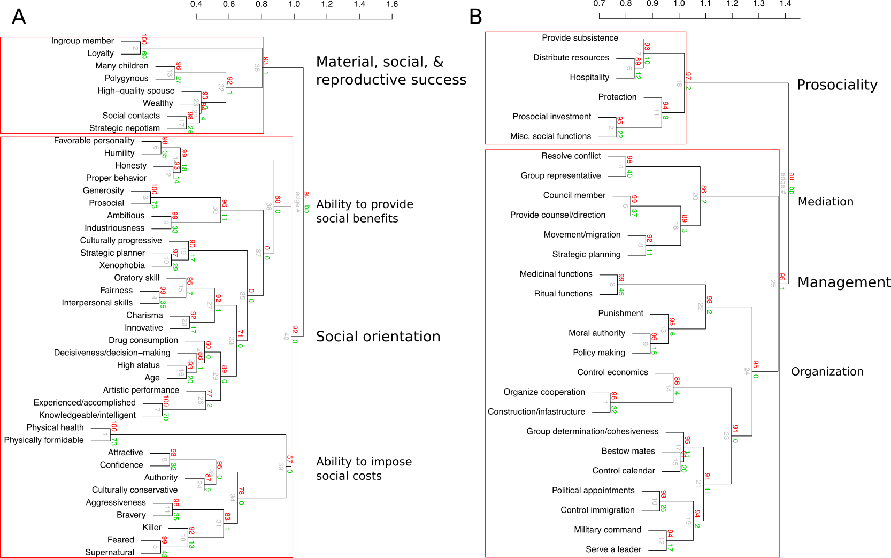

```{r setup, include=FALSE}
knitr::opts_chunk$set(echo = FALSE, warning=FALSE, message=F)
source('analyses2.R')
library(pander)
```


<!-- A thematic note: One of our primary goals is to explore how an evolutionary framework can illuminate when we expect to find cultural, behavioral, physiological, etc. variation and then explain (some of) that variation. Part of going "Beyond WEIRD" is getting to theories that can account for population-level variation and predict invariant universals (or, at least, less variable phenotypes). We want to push things beyond the 'butterfly collecting' of simply documenting population-level variation. -->


# Abstract

Leader-follower dynamics are central to much of social life. Processes of leadership and followership observed in traditional societies, especially among small-scale societies, are often quite distinct from those observed among WEIRD societies and their complex organizations. Many researchers have turned to evolutionary theory to integrate diverse perspectives on human leadership and to better understand the diversity of leadership and followership observed across human cultures and across social contexts. Evolutionary theories of leadership, in turn, draw on ethnographic case studies from traditional societies that are thought to more closely resemble the small, face-to-face societies in which humans evolved. Currently, though, there is limited systematic data on the nature of leadership in such societies.

We build on our previous cross-cultural findings to systematically review the nature of leadership across the full range of human cultural diversity. Over 1200 ethnographic texts from the Human Relations Area Files (HRAF) were coded on leader qualities, their functions, and the costs and benefits for both leaders and followers across diverse social contexts. We discovered evidence for both cultural universals in leadership, as well as important variation, especially when compared to leadership in WEIRD societies. Across all contexts, leaders in the ethnographic record are most commonly described as intelligent and knowledgeable, of high social status, accomplished, wealthy, and prosocial. The primary benefits leaders offer to followers are resolving conflicts, organizing cooperation, providing social functions, leading in inter-group conflicts, providing ritual services, and distributing resources. The primary benefits leaders receive from followers include non-food resources, increased social status, and social services from followers. The most frequent costs of leadership for leaders include loss of social status and resources, and increased risk of harm or conflict. For followers, the most frequent costs include loss of resources, costs in providing social services, and increased risk of harm or conflict.

Leadership in WEIRD settings often differs substantially from non-WEIRD settings. In WEIRD settings influence often extends into multiple domains, organizations are more hierarchical, and interactions between leaders and followers are less frequently face-to-face. A detailed view of leaders, their roles, and the costs and benefits of leadership across traditional societies and across contexts stands to make a significant empirical contribution for the development of more integrative evolutionary theories of leadership and social hierarchy.

# Introduction

>It's good to be king, if just for a while. - Tom Petty

Across human societies, the influence of leaders stands to substantially shape the nature of group structure and group outcomes. Simultaneously, social norms, competing leaders, pressures from rival or cooperative groups, and followers preferences can greatly constrain a leader's agenda. The interactions between the strategies of individual leaders, pressures of followership, and group dynamics are likely to strongly contribute to organizational variation across human populations including social and economic trajectories [@wiessner_risk_1982] and cultural evolutionary processes [@henrich_big_2015]. 

Leadership and followership are critical in understanding group structure and have been the focus of much scientific attention across psychology, sociology, political science, and managerial studies. Until recently, this very large body of work was relatively disconnected from approaches to leadership in anthropology and biology. Under a unifying evolutionary framework, social and biological scientists have now produced a sizable body of theory on the evolution and cross-cultural patterning of leadership and followership [e.g., @price_evolution_2014; @henrich_big_2015; @richerson_tribal_2009; @van_vugt_evolutionary_2006; @pietraszewski_evolution_2019; @hooper_theory_2010; @kaplan_evolutionary_2009; @von_rueden_roots_2014; @hagen_leadership_2019], accompanied by a growing body of empirical results [e.g., @bowser_womens_2010; @cheng_two_2013; @garfield_investigating_2019; @garfield_evolutionary_2019; @von_rueden_leadership_2014; @von_rueden_sex_2018; @smith_leadership_2016; @smith_obstacles_2018]. This integration as been informative. Drawing on the study of leadership in evolutionary perspective and across diverse, small-scale and traditional societies can help develop more generalizable theories and offer applications to shape organizational structure in ways which are more consistent with human evolutionary history and evolved leader-follower psychologies [@von_rueden_leadership_2015; @garfield_review_2019; @van_vugt_selected_2010]. Nonetheless, much of this work has focused on community or political leaders, often overlooking the nature of leadership and followership across social domains and at all levels of social organization. Moreover, while the benefits leaders accrue for their services have received substantial attention the costs of leadership for both leaders and followers have been relatively under-investigated. Current outstanding questions for evolutionary leadership scholars include the degree to which the nature of leadership is shaped by population-level variation at different levels of social organizations and the costs and benefits leaders and followers incur across distinct leadership systems. 

Evolutionary scholars typically define leaders as individuals who maintain disproportionate influence over decision-making within groups [@von_rueden_leadership_2015], whatever the group may be. Leadership roles are also often associated with specific rights and responsibilities. Not surprisingly, the functions leaders serve then are often closely linked to group contexts and the salient challenges groups face. Certain types of groups, such as kin groups, economic groups, or political groups, may tend to favor leaders with specific qualities, however there can be substantial variation in the traits of leaders within these groups as well as between them.

We first briefly review theoretical, ethnographic, and empirical perspectives on the qualities of leaders, the functions they serve, and the costs and benefits of leadership across human societies, including WEIRD and non-WEIRD populations. We then outline the aims and methods of the current cross-cultural study, before presenting results and interpretations. Through novel exploratory analyses encompassing the full range of cultural diversity and social contexts, we aim to advance leadership studies across disciplines and provide researchers with a foundation for more detailed approaches to human leadership across cultures and contexts.   


<!-- Reference a historical example of a short term leader implementing change with lasting effects, good and/or bad. -->

## The functions of leadership across cultures and contexts

Leaders emerge in all human societies. That is, within every population there are particular contexts in which one individual maintains a disproportionate level of influence in the group and functions to facilitate group goals and provides services to the group. Adopting the broad definition of leadership given above, parents can also be defined as leaders of nuclear families. Strong community leadership, however, is extremely common cross-culturally including among hunter-gatherers and relatively small-scale societies [@garfield_review_2019; @von_rueden_leadership_2015].  

Despite the universality of the phenomenon of leadership, the nature of leadership across populations and across social contexts is highly diverse and the emergence of leaders and the functions they serve are expected to be closely tied to group structure and group goals [@van_vugt_cognitive_2007]. Among many of the ethnographically described small-scale societies, which generally lack multi-level, institutionalized social and political structures, leadership at the community level is typically informal and ephemeral and leaders emerge contextually when demands of coordination or conflict resolution require a managerial presence [@von_rueden_leadership_2015]. Leadership tends to be context-specific and leaders in such contexts often draw on persuasive capacities and leverage community-based respect, specialized skills or knowledge, and social support to achieve or maintain community influence [@kantner_identifying_2010; @lewis_leaders_1974; @boehm_egalitarian_1993]. The theoretical and ethnographic literature suggests these demands most commonly arise in the contexts of collective actions and in conflict resolution [e.g., @glowacki_leadership_2015; @gavrilets_convergence_2016; @hooper_theory_2010; @von_rueden_solving_2015; @henrich_big_2015; @pietraszewski_evolution_2019]. Demands of mediation in within-group conflict resolution, although variable in scale, are probably a universal feature of human groups [@king_origins_2009; @van_vugt_leadership_2008]. Demands of between-group interactions, including both conflict and cooperation are also very common across small-scale societies, including hunter-gatherers [@glowacki_evolutionary_2017; @hames_pacifying_2019; @richerson_cultural_2016; @henrich_evolution_2009; @apicella_social_2012]. Across relatively small-scale societies, at the community level, representing the group and managing both internal and external relationships and conflicts are expected to be the most salient functions of leaders. Within communities, however, leaders may emerge whenever individuals form groups. The role of leaders in ritual contexts, such as in initiations [@singh_cultural_2017], and in providing social services, including facilitating marriages [@walker_evolutionary_2011] and organizing social activities [@wiessner_food_1996], are also expected to be common functions leaders serve. 

Increased sedentarization and defensibility of resources is often associated with both social stratification and institutionalized managerial roles including stronger authority of community leaders and leadership beyond the community level [@johnson_evolution_1987; @johnson_organizational_1982; @kaplan_evolutionary_2009; @ames_hierarchies_1985; @panchanathan_indirect_2004]. Among horticulturalists and agriculturalists managerial leadership can promote more efficient use of shared resources such as water reserves and cooperative labor [e.g., @von_rueden_leadership_2014]. Pastoralists and coastal populations often face similar pressures concerning grazing lands and fishing access [e.g., @widmer_evolution_1988; @stevens_sherpa_1990]. In the wake of economic intensification, the functions of leadership becomes increasingly associated with managing economic systems and distribution of resources. Defensibility of critical resources creates increased opportunities for resource management and is often associated with increased territoriality and increased pressures of inter-group conflicts [@glowacki_evolutionary_2017]. Community leaders among populations more reliant on domesticated plant foods, livestock, and specific territories are often required to manage military forces and develop both offensive and defensive strategies in warfare, more so than mobile populations that rely on dispersed, less defensible resources [@lopez_evolutionary_2017].

In WEIRD societies, community leaders are primarily heads of governmental and corporate bodies [@bass_handbook_1990]. Other public service, nonprofit leaders, and managers include law enforcement and police officers, college presidents and school principles, and grassroots community leaders [@martiskainen_role_2017; @azzam_community_2003; @grace_school_2005]. These positions typically are associated with institutionalized responsibilities and specific functions associated with their roles. The structure of such organizations are generally organized hierarchically with nested bodies and a formal internal 'chain of command.' At higher levels of large-scale organizations, leaders primarily serve as representatives in inter-group interactions, facilitate the creation and adoption of policies, and serve as figure heads embodying the strategic vision of the organization [@keohane_thinking_2010]. They are not typically directly involved in resolving interpersonal conflicts between individuals, however, they are often the final end-point in a decision making hierarchy and the results of a single decision of these leaders can trickle down through industry or government with global ramifications. 

Scholars in managerial studies have long discussed the behaviors of leaders and managers have developed multiple models on the functions of leadership. Classic management theorists [e.g., @davis_learning_1951] emphasized the planning, organizing, and controlling functions of leaders in formal organizational and business settings [see @bass_handbook_1990]. These perspectives focused on the rational, mechanistic aspects of group functioning and often overlooked interpersonal dynamics. Later theorists incorporated cognitive and socioemotional components of leadership functions. For example, @selznick_leadership_1957 describes the functions of organization leaders is to define the goals of the organization, create structures for accomplishing group goals, defend institutional integrity, and maintain internal consistency among group members. 

@wofford_factor_1970 provides an early empirical view of managerial functions. A factor analysis of managerial behaviors from over 130 US employees' survey responses identified five interpretable, orthogonal factors: (1) an *order and group achievement* factor, identifying participative, democratic, and organizational planning function; (2) a *personal enhancement oriented* factor, associated with authority and control, (3) a *personal interaction* factor, associated with interpersonal relationships and employee support, (4) a *security and maintenance* factor, associated with self-preservation, and (5) a *dynamic and achievement oriented* factor, associated with aggressive, self-assured actions. Wofford's analysis provided a foundation for future empirical studies of leadership and management functions. He contrasted factor one type management, described as the "professional administrator" who effectively collaborates and integrates team members, from factors two and five, described as "autocratic leaders" strongly motivated by personal power and a willingness to rely on aggressive tactics [@wofford_factor_1970]. 

More recently, many managerial scholars have adopted a comparative approach to better understand cultural diversity in leadership systems, drawing on Culturally Endorsed Implicit Leadership Theory (CLT), which suggests cultural variation in social norms has the potential to impact follower preferences for leadership styles [@moore_literature_2018]. The Global Leadership and Organizational Behavior Effectiveness (GLOBE) project is a large-scale international research program aimed at understanding leader effectiveness and cultural variation across large organizations. The GLOBE project has produced multiple cross-national data sets on leadership and hundreds of publications. For example, *The GLOBE Study of CEO Leadership Behavior and Effectiveness in 24 Countries* draws on data from over 1,000 CEOs and over 5,000 senior executives from corporations in varied of industries across 24 countries. The goals of the GLOBE CEO Study were to address (1) how national culture influences expectations for the behaviors of leaders, (2) which behaviors of CEOs are typically associated with organizational success, (3) differences between high-functioning and low-functioning CEOs, and (4) the importance of CEO behaviors aligning with societal expectations. Through path analysis the study concluded that cultural values indirectly predict CEO leadership behavior through culturally endorsed leadership expectations. That is, leaders moderate their behavior through culturally learned values and leadership-specific values.  

The GLOBE CEO Study defines six "global leadership behaviors" developed from 21 "primary leadership behaviors." Among the global leadership behaviors, the GLOBE CEO Study found that charismatic leadership behavior is consistently the most important behavioral trait regarding firm performance and dedication of top management team (TMT) members, followed by team-oriented behavior and human-oriented behavior. Participative leadership was moderately related to TMT dedication, however was not related to firm performance. The most successful CEOs are those who are rated as more visionary, performance oriented, and decisive. Furthermore, results strongly suggest the fit between a CEOs behavioral profile and the expectations of leadership within a society strongly predict TMT dedication and firm performance.

NEED CONCLUSION PARAGRAPH/STATEMENT. 


## The qualities of leaders across cultures and contexts

Across culturally and economically diverse populations there are some broad commonalities in the qualities of community leaders. When strong community leaders emerge, they are most typically high status males who embody the ideal qualities most respected by the group and necessary for successful leadership in the domains in which they have influence [@henrich_evolution_2001; @van_vugt_evolutionary_2006; @collier_politics_1981; @low_men_1992; @roscoe_social_2019]. Elders, respected individuals, and highly intelligent or knowledgeable individuals tend to have greater influence over community decisions across cultures, including among the most egalitarian hunter-gatherers, stratified chiefdoms, and contemporary state-level organizations [@silverman_how_1978; @van_vugt_cognitive_2007; @tooby_cognitive_2006; @garfield_review_2019; @bass_handbook_1990]. Drawing on cross-national data through the GLOBE project from over 15,000 middle managers across 60 countries, @den_hartog_culture_1999 conclude that elements of charismatic and transformational leadership -- leadership styles when leaders express an inclusive vision of future progress, lead through inspiration, and develop initiatives in collaboration -- are universally endorsed across nations and are perceived to be associated with effective leadership. In particular, inducing motivation, having foresight, being encouraging and communicative, trustworthiness, and building self-confidence among followers are suggested to be universal attributes of outstanding leadership in managerial contexts. 

<!-- Other attributes of charismatic leadership found to be culturally contingent included ambitiousness, self-effacing, enthusiasm, and risk-taking [@den_hartog_culture_1999].  -->

Among small-scale societies with relative egalitarianism and local political autonomy community leaders, in addition to being older, respected males, tend to be individuals with large social networks and strong social support [@von_rueden_leadership_2014; @von_rueden_roots_2014; @walker_living_2012]. Physically, leaders across multiple contexts tend to be taller and more physically formidable. Such embodied capital might equip individuals for more effective leadership in the context of inter-group conflicts as well as in the context of intra-group dispute settlement and in management of collective actions [@lukaszewski_role_2016; @von_rueden_leadership_2014; @von_rueden_roots_2014]. Charisma and oratory skills are common properties of leaders, but are especially important in the context of egalitarianism where individual leaders must rely on persuasion and more subtle forms of influence to convince community members to come to agreement [@grabo_charismatic_2016].

In the context of institutionalized social stratification, such as chiefdoms and many agricultural populations, community leadership is often highly influenced by heredity and formal class structures [@earle_how_1997; @stanish_evolution_2004; @redmond_introduction_1998]. Managerial elites, who maintain influence over community decisions are endowed with a high degree of social status rooted in ideologies and associated with their roles or kin group [@stanish_evolution_2010]. In such contexts community leaders often lack strong coercive authority, but maintain substantial influence through ideological systems and ritual or religious prowess inaccessible to non-elites [@stanish_evolution_2010]. The association of formal community leadership and supernatural abilities is likely an important precursor of institutionalized and coercive authority. 

Within state-level societies including non-industrial kingdoms leadership positions are proscribed and institutionalized. Ruling classes, parties, or political bodies monopolize social and political influence and maintain control through a variety of mechanisms including military force, ideological systems, and through the control of information and propaganda [@cohen_comparative_1967; @bodley_cultural_2011]. 

Across disciplines many theoretical models and empirical findings have implicated high intelligence as an important quality positively associated with effective leadership [e.g., @johnson_leadership_2015; @judge_intelligence_2004; @neel_being_1980; @antonakis_does_2009]. Recent cross-cultural evidence and from a small-scale society implicates strong relationships between perceptions of intelligence and leadership among males [@garfield_evolutionary_2019; @garfield_investigating_2019]. These results suggests high intelligence and specialized knowledge are universal traits of political and community leaders. 

Within managerial studies scholars often suggest the cognitive demands of leadership escalate with increasing organizational complexity [@zaccaro_organizational_2002]. More complex organizations require leaders equipped to process complex information, understand distinct departmentalized bodies, and resolve conflicting points of view, as well as be equipped to socially manage diverse individuals [@bass_handbook_1990; @schneider_organizations_2006; @antonakis_does_2009]. However, recent evidence suggests a curvilinear effect in that exceptionally intelligence individuals at the high end of the distribution may not be the most effective leaders in contemporary business settings [@antonakis_can_2017].

<!-- COULD GET INTO LEADER VS MANAGER DISTINCTION -->

NEED CONCLUSION PARAGRAPH/STATEMENT.


## The benefits and costs of leadership across cultures and contexts

<!-- BENEFITS: DECISIONS IN THEIR INTERST -->
The ability to shape group dynamics can provide enormous individual benefits to leaders, even if 'just for a while.' Fundamentally, leaders in any context have the opportunity to promote group-level policies which either align with their individual interests or which are not especially costly for themselves, their kin, or their close social partners [@garfield_evolutionary_2019; @kantner_identifying_2010; @hagen_leadership_2019]. 
<!-- BENEFITS: HIGH SOCIAL STATUS -->
Leadership positions, including formalized institutionalized roles and informal ephemeral roles, are also often if not universally associated with increased social status. The causal relationship between high social status and community or political leadership is complex and likely to be context-specific and bi-directional, but leadership roles through their association with increased social status are widely associated with numerous social, material, and reproductive benefits [@von_rueden_roots_2014; @von_rueden_multiple_2008; @grammer_symptoms_1996; @cheng_psychology_2014]. 
<!-- BENEFITS: SOCIAL BENEFITS, SOCIAL NETWORK -->
Leaders and high-status individuals are also more likely to be the recipients of social support and material benefits in times of need [@gurven_its_2000; @von_rueden_roots_2014; @sugiyama_illness_2004]. Across many industries and organizations leadership positions are associated with increased financial compensation [@tsui_income_2017]. High social status, material wealth, intelligence, and leadership status are also viewed as sexually attractive, particularly among women [@buss_strategies_2006; @stanik_who_2010].
<!-- NEED BETTER CITATIONS ABOVE -->
<!-- BENFITS: MATING -->
Across diverse populations and organizations, community leaders, political leaders, and organization leaders tend to have greater mating opportunities and therefore, given the aforementioned male-bias in top leadership positions, these leaders also tend to have greater reproductive success. In a phylogenetic multilevel metaanalysis of 288 reported statistical associations among nonindustrial societies, @von_rueden_mens_2016 found that most measures of reproductive success were positively associated with male social status, independent of subsistence type or status measure. 

<!-- BENEFITS: 'MODEL' OF POTENTIAL BENEFIST -->
@von_rueden_leadership_2015 review a large body of theory and ethnography and outline four possible mechanisms by which leaders in small-scale societies might offset the potential costs associated with various leadership roles; leaders may, (1) facilitate collective actions that yield net benefits to themselves or their close kin; (2) claim a fee for their services, such a tax or greater share of returns; (3) receive reciprocal exchange in other currencies from followers who have benefited from their services; or (4) gain other social or reproductive benefits by signaling their high quality as a mate and social partner.

<!-- COSTS: OPPURTUNITY COSTS -->
Evolutionary models of leadership generally assume the benefits of leadership outweigh the costs, for both leaders and followers. However, the unique costs associated with various leadership positions have received less attention, relative to the benefits of leadership, across disciplines. Group responsibilities necessarily impose opportunity costs on individual priorities, given leadership responsibilities require investments of time, energy, and resources that could be invested elsewhere. 
<!-- COSTS: INCREASED SOCIAL OR PHYSICAL RISK FROM MEDIATION - SSS -->
Mediating conflicts between individuals can be physically and socially costly [@wiessner_power_2010]. Devising and proposing compromises and optimal outcomes can be cognitively challenging and the solutions leaders propose are unlikely to be equally satisfactory for everyone involved. Therefore, leaders stand to become the targets of animosity. In the absence of state-based systems and institutionalized inequalities, all group members are on relative equal footing and equipped to challenge leaders directly or indirectly using a variety of leveling mechanisms including overt physical aggression or indirect aggression, such as gossip and social ridicule [@boehm_purposive_2008; @hess_gossip_2017]. Physically formidable individuals with strong social networks are likely to be able to bear these costs more so than their counterparts. Larger body size and high social capital are qualities often associated with leaders in small-scale societies [@glowacki_leadership_2015]. With greater population density and wealth inequality, these risks are expected to concomitantly increase in magnitude. In managing collective action and enacting group-level policies, some behaviors of leaders will upset some followers and leader-follower interactions can be hostile.

<!-- COSTS: INCREASED SOCIAL OR PHYSICAL RISK FROM MEDIATION - LSS -->
Conceptualizing leadership as a possible solution to problems associated with collective goods [e.g., @olson_logic_1965; @glowacki_leadership_2015; @hooper_theory_2010; @pietraszewski_evolution_2019], where group members pool resources and share costs of public goods to receive a net benefit from a cooperative endeavor, leaders incur costs associated with managing contributions, coordinating behaviors, and broadcasting information to maintain coordination and cooperation. In this framework, leaders and followers voluntary participate in a cooperative enterprise with the expectation that benefits will outweigh the associated costs. @rich_dynamics_1980 adopts this framework of collective costs and benefits to understand leadership and group dynamics in urban neighborhoods and neighborhood organizations in WEIRD settings, which can be viewed as self-interested groups that face group-wide problems and necessarily share public benefits. The costs associated with leadership in neighborhood organizations follow those associated with other collective enterprises (e.g., investments of time and energy in management and maintenance of group coordination). @rich_dynamics_1980 conceptualizes four categories of the benefits associated with neighborhood organization. Leaders of neighborhood organizations (1) may receive benefits of the public goods produces from collective actions (as other non-leaders would as well); (2), may receive selective benefits from surpluses produced through collective actions; (3) may receive incidental benefits from their leadership role; and (4) leaders of neighborhood organizations may enjoy their service in the position. @rich_dynamics_1980 interviewed 54 officers from 11 metropolitan neighborhood organizations in the Midwest US. Results from extensive interviews suggest personal fulfillment and enjoyment are the main motivational drivers of participation in leadership roles of neighborhood organizations, suggesting the process of leadership for individuals is distinct from theoretical models rooted in economics. Therefore, a primary benefit of leadership, in some contexts, is likely to be intrinsic personal fulfillment and the opportunity to execute personal values of community service. 

NEED CONCLUSTION STATEMENT/PARAGRAPH. 


# Study aims

Evolutionary theoretical models and empirical studies often seek to integrate findings within a broad framework of human cultural diversity. The universality of human leadership systems and the incredible diversity among the qualities of leaders across cultures and contexts and the functions leaders serve is difficult to capture. Scholars are then left to haphazardly self-select ethnographic cases or rely on the self-selected reviews of others for generalizations [e.g., @garfield_review_2019; @von_rueden_leadership_2015]. Here, we seek to provide the first empirical and near comprehensive view of the qualities and functions of leaders across human societies from a representative cross-cultural sample. We also provide the first comparative view describing the costs and benefits of leadership for both leaders and followers in an evolutionary biological framework. We also aim to explore how the qualities and functions of leaders vary across social contexts and levels of cultural complexity.

In sum, we seek to empirically and systematically accomplish the following three goals: 1) identify the most cross-culturally frequent *qualities of leaders* and the *functions they serve*; 2) identify *features* of the qualities and functions of leaders in reference to theoretical models or novel interpretations; 3) identify the most cross-culturally frequent *costs and benefits* of leadership for both leaders and followers. Such exploratory results stand to facilitate more fine-grained approaches within leadership studies and greater theoretical and empirical work beyond community leadership, while also revealing the importance of a broad, cross-cultural perspective in understanding the psychology and cultural patterning of perhaps the most foundational component of human social behavior and organization.

<!-- and 4) explore relationships between measures of leader qualities and functions with group structure and population-level measures.  -->

 


# Methods

## Ethnographic sample and coding

We evaluate the cross-cultural frequency in the functions and qualities of leaders and the costs and benefits of leadership for both leaders and followers using an ethnographic database previously built and published (doi.org/10.5281/zenodo.2541999), from which @garfield_evolutionary_2019 "tested" three theoretical models against the ethnographic record. Whereas @garfield_evolutionary_2019, documented supporting evidence for measures of leadership in reference to influential theoretical models, our goals here are to let the ethnographic record speak for itself in understanding variation in the dimensions of leadership we are interested in, i.e., our methods and analyses are exploratory and not strictly theoretically driven.

Here we draw on the same database of 1212 ethnographic paragraphs (termed text records) extracted from the 60-culture Probability Sample Files (PSF) of the electronic Human Relations Area Files (eHRAF) database [@naroll_proposed_1967]. The *leadershipdata* database was designed to capture a wide sample of the ethnographic record of leadership. For the current study, two authors coded each text record for presence of `r length(quality_vars)` distinct qualities of leaders, `r length(function_vars)` distinct functions leaders serve, and `r length(leader_benefit_vars)` benefits and `r length(leader_cost_vars)` costs that leaders or followers may receive. 


The operationalized qualities and functions (See Table \@ref(tab:qualfuncvars)) were developed from the ethnographic text records in the database. First ZG read a subset of text records and developed initial variable lists and operationalizations of the qualities and functions in those text records. Then, KS coded all 1212 text records (in a random order) for the operationalized qualities, functions, cost, and benefits, while also creating new variables and operationalizations for additional qualities and functions encountered. After coding half of the random sample KS and ZG revised the operational definitions to produce the final list of variables in Table \@ref(tab:qualfuncvars). ZG then followed the same process of coding the entire sample of 1212 text records for the `r length(c(quality_vars, function_vars, leader_cost_vars, leader_benefit_vars, follower_benefit_vars, follower_cost_vars))` operationalized variables. DISCUSS IRR. ZG and KS then discussed every instance of disagreement between their respective coding to produce a consensus matrix, which is used in the analyses here and added to the published data repository (a data frame named *leader_text2*).

```{r qualfuncvars, echo=FALSE, message=F, warning=FALSE}
library(readr)
qual_func_var_tab<-read_csv('func_qual_definitions.csv', na = 'NA')
library(knitr)
kable(qual_func_var_tab, caption = "Operational definitions for coded leader qualities and functions.")
```

Coding operationalizations of the costs and benefits of leadership were developed *a priori* based on our reading of the evolutionary theoretical literature from anthropology and biology. For both followers and leaders, we code if there is evidence of costs or benefits in the following categories: social status, reduced or increased risk of harm or conflict, social services, territory, mating, fitness, food resources, material resources, and other miscellaneous costs or benefits not captured by these categories. See Table \@ref(tab:costbenefitvars).

```{r costbenefitvars, echo=FALSE, message=F, warning=FALSE}
library(readr)
cost_benefit_vars_tab<-read_csv('costs_benefits.csv', na = 'NA')
library(knitr)
kable(cost_benefit_vars_tab, caption = "Operational definitions for coded benefits and costs for leaders and followers.")
```

For additional details on ethnographic sampling and creation of the *leadershipdata* package see @garfield_evolutionary_2019. 

## Statistical analysis

We analyzed data from our researcher-coded operationalized variables at the text-record level and at the culture-level. Our first goal was to assess the proportion of text records and cultures that provided evidence for each of our coded variables to discover the qualities and functions of leadership that are most and least frequently noted in the ethnographic record.

Our second goal was to discover "features" in our data, e.g., to determine if particular variables tended to covary or cluster together. Such features might lend support to existing theories; for instance they might correspond to "prestige" and "dominance" [@henrich_evolution_2001]. Or they might suggest new and theoretically important dimensions of leadership. 

There are numerous approaches to detecting features in matrix data such as ours, many of which employ various dimensionality reduction and clustering techniques. To reduce the dimensionality of the `r length(quality_vars)` leader quality variables and the `r length(function_vars)` leader function variables, all of which take binary values (0, 1), we used logistic PCA from the logisticPCA package. This algorithm projects the natural parameters of the saturated model onto the lower $k-$dimension space that minimizes the Bernoulli deviance [@logisticPCA].

Prior to analysis we removed all rows that had no evidence for any variable, which resulted in `r nrow(pca_data_qualities)` text records for the leader quality variables and `r nrow(pca_data_functions)` text records for the leader function variables. We used cross-validation to optimize rank, $k$, and a tuning parameter, $m$ (the value to approximate the saturated model), per recommendation of the package authors.

<!-- To identify natural groupings of variables among the research coded leader quality and leader function measures, we conducted two cluster analyses using the pvclust package [@suzuki_pvclust:_2015]. These analyses allow us to interpret *post-hoc* (1) the degree to which coded variables relate to established theoretical models, (2) identify potential phenotypic profiles of leaders, and (3) offer empirical and theoretical future directions related to suites of qualities or functions likely to covary. -->

We also performed hierarchical cluster analysis on our quality and function variables. We computed distance between our binary vectors using both $1-cor(x, y)$ and asymmetric binary distance (Jaccard distance), and agglomerated using the Ward algorithm. We assessed the robustness of the clusters using the pvclust package [@suzuki_pvclust2006], which computes an unbiased probability that a cluster appears in bootstrapped samples. We used 10,000 bootstrapped samples.

Our third goal was to determine which leader and follower benefits and costs were most commonly mentioned in the ethnographic record.

<!-- Our fourth goal was to explore associations between the principle components of leader qualities and functions, and culture-level variables such as mode of subsistence, social complexity, population density, and group size, and effects of group type, such as political groups versus kin groups. We used linear mixed effects models from the lme4 package [@bates2015], with PC1 and PC2 as outcome variables, culture-level variables as predictors, and documents nested within cultures as grouping variables for random intercepts.  -->

All analyses were conducted with `r R.version.string`.

# Results

The geographic distribution of the cultures in our sample is displayed in Figure \@ref(fig:geographic), with cultures labeled by mode of subsistence and represented by a symbol proportional to the number of documents that provide ethnographic texts for that culture. The `r nrow(leader_text2)` text records from `r length(unique(leadershipdata::documents$d_ID))` unique documents describing `r length(unique(leader_text2$d_culture))` cultures were generally short, ranging from `r textstats$min` to `r textstats$max` words, with a median word count of `r textstats$median`, a mean of `r textstats$mean`, and standard deviation of `r textstats$sd`. Of the `r nrow(leader_text2)` text records, `r final_record_count` had evidence for at least one variable in the study.


```{r geographic, fig.width=15, fig.cap="The geographical distributions of cultures in this analysis. Symbol shapes indicate mode of subsistence and symbol size indicates the number of documents available for that culture."}
library(maps)
world_map <- map_data("world")
p_map <- ggplot(world_map, aes(x = long, y = lat)) +
  geom_polygon(aes(group = group), fill="lightgray", colour = "white") +
  geom_point(
    data = leader_cult, 
    aes(
      c_longitude, 
      c_latitude, 
      colour = subsistence, 
      shape = subsistence, 
      size = documents
    )
  ) +
  coord_fixed() +
  labs(x='', y='', shape = 'Subsistence', colour = 'Subsistence', size = 'Documents') +
  guides(shape = guide_legend(override.aes = list(size = 4))) +
  theme_bw(15)
p_map
# ggsave(filename = 'Figures/map.pdf', p_map)
```


<!-- NEED TO DISCUSS 1187 and split records.  -->

## Distribution of text records by mode of subsistence and group type


The type of group to which a leader text referred was coded into seven researcher-coded categories: residential groups, kin groups, economic groups, political groups at the community level, political group beyond the community level, military groups, and religious groups. Figure \@ref(fig:groupsex) indicates the proportion of text records that were categorized into each of these groups, broken out by mode of subsistence. We rely on a modified classification of subsistence from the HRAF, collapsing “hunter-gatherers” and “primarily hunter-gatherers” into a single category, “hunter-gatherers,” and by collapsing “agro-pastoralists” and “pastoralists” into a single “pastoralists” category. We renamed the HRAF’s “Other” subsistence category, which is applied to societies with various combinations of hunting, fishing, gathering, pastoralism, and horticulture or intensive agriculture, as “mixed.” This produced a subsistence classification with five groups: Hunter-gatherers, Pastoralists, Horticulturalists, Agriculturalists, and Mixed.

```{r groupsex, fig.width=20, fig.height=10, fig.cap="The distribution of text records by subsistence and group type. Areas of the bars are proportional to the number of text records in that category."}
plot_group_subsis #+ plot_group_sex
```

The vast majority of text records pertained to male leadership (`r male_leader_pct`%) and very few pertained to female leadership (`r female_leader_pct`%), with some records not sex-specific. There were female leaders in almost all types of groups, however, except military and religious. Female leaders did tend to lead at the kin group and other residential subgroups, though: `r female_residential_pct`% of female leaders led at the residential subgroup level, for instance, compared to `r male_residential_pct`% of male leaders.

As Figure \@ref(fig:groupsex) reveals, the distribution of text records by group type varies across subsistence type. Across all subsistence types, the most frequent group type is political groups at the community level, with the exception of agriculturalitsts in which supracommunity political groups are the most frequent group type. Leadership beyond the community level is relatively rare outside of agricultural populations and is especially rare among hunter-gatherers. Leadership within residential groups is most frequently associated with hunter-gatherers (`r hg_residential_pct`% of the total sample of hunter-gatherer text records) and leadership within kin groups is most frequently associated with hunter-gatherers (`r hg_kin_pct`% of the total hunter-gatherers sample) and horticulturalists (`r hort_kin_pct`% of the total horticulturalists sample). 

<!-- SHOULD WE PUT THE ENTIRE TABLE IN SI? -->

## Variable distributions

For each of the `r length(c(quality_vars, function_vars, leader_cost_vars, leader_benefit_vars, follower_benefit_vars, follower_cost_vars))` coded variables (see Tables \@ref(tab:qualfuncvars) and \@ref(tab:costbenefitvars) ), we computed the percentage of text records that provided support, estimating standard errors using a binomial generalized linear mixed effects model with a random intercept for author nested within culture (which partially accounts for potential variation due to differences in ethnographers such as gender, nationality, or philosophy). See Figure \@ref(fig:varsupport).

```{r varsupport, fig.width=15, fig.height=15, fig.cap="Support for each coded variable of leader functions (top) and qualities (bottom). Blue circles: percent of text records with evidence of support (95% CI computed with a binomial mixed effects models with random intercept for author nested within culture). Red triangles: percent of cultures with evidence of support (95% CI computed with a cluster bootstrap)."}
plot.variable.support
```

The most common *functions* leaders serve, which are documented in over 70% of cultures, are resolving conflicts, providing various social functions, organizing various cooperative activities, and providing counsel or direction in follower's affairs. Leaders also commonly serve as a representatives in inter-group interactions, manage the distribution of resources, and provide context-specific leadership such as military command and in providing ritual services. In about half of the cultures sampled here leaders punish other group members and manage economic systems. Notable infrequent functions include controlling group movement and migrations. 

The most common *qualities* of leaders are being of high social status (documented in over 90% of cultures), being experienced or accomplished, and being described as knowledgeable or intelligent (documented in approximately 80% of cultures). Also, in about 60% of the cultures sampled here leaders were wealthy, nepotistic, possessed supernatural qualities, were generous, or maintained strong authority over followers. Notable infrequent qualities of leaders in these data include physical formidability and high social contacts (documented in about 35% of cultures) and charisma and fairness (documented in about 20% of cultures). 

## Cluster analyses

Within each cluster analyses, we computed the distance between two variables as $1 - cor (v_i, v_j)$, so that the distance between highly correlated variables is close to $0$, the distance between uncorrelated variables is close to $1$, and the distance between uncorrelated variables us close to $2$. Using the pvclust package [@suzuki_pvclust2006] we clustered the variables using the matrix of all pairwise distances using the Ward agglomeration algorithm. 

Figure \@ref(fig:cluster)A displays a dendrogram from the cluster analysis of the `r length(quality_vars)` leader quality variables and Figure \@ref(fig:cluster)B displays a dendrogram from the cluster analysis of the `r length(function_vars)` leader function variables. Each cluster analysis includes two estimates of significance for how strongly each cluster within the dendrogram is supported by the data. We rely on the AU (Approximately Unbiased) *p* values, which are computed by multiscale bootstrap resampling and represented as percentages (e.g., clusters with AU values $>95$ are strongly supported, and the top-level clusters are automatically highlighted by rectangles).

```{r cluster, fig.cap="Cluster analysis of leader quality variables (left) and leader function variables (right). Distances are $1 - cor$. Ward agglomeration method. p-values computed with 10,000 bootstrap samples using the pvclust package [@pvclust2015]."}
# plot(m_pvclust_qual)
# pvrect(m_pvclust_qual, alpha = 0.9)

```

The leader quality cluster analysis (Figure \@ref(fig:cluster)A) identified two top-level clusters. Within each top-level cluster we identify two interpretable and generally strongly supported sub-clusters which are annotated with text. Within the first top-level cluster, we identify a dominant/shaman cluster, which suggests a strong link between dominance-based leadership (i.e., *Authority*, *Aggressiveness*, *Feared*) and shamanism (i.e., *Supernatural*, *Artistic performance*). The second sub-cluster includes qualities of leaders related to material, social, and reproductive success (i.e., *Wealthy*, *Social contacts*, and *Polygnous*). Within the second top-level, we identify a sub-cluster of positive personal characteristics (i.e., *Knowledgeable/intelligent*, *Proper behavior*, *Charisma*, *Fairness*) and a sub-cluster of measures related to social strategies and health (i.e., *Strategic planner*, *Generosity*, *Physically formidable*). The leader functions cluster analysis (Figure \@ref(fig:cluster)B) also identified two top-level clusters; the larger of which we identify as an organizational functions cluster (i.e., *Organize cooperation*, *Military command*, *Resolve conflict*) and the smaller a prosociality cluster (i.e., *Social functions*, *Distribute resources*, *Hospitality*). 

<!-- ## Principle components analyses -->

<!-- A logistic PCA on the `r length(quality_vars)` coded leader quality variables, with rank $k = `r dim(logpca_model_qualities$U)[2]`$ and  $m = `r logpca_model_qualities$m`$ optimized by cross-validation, explained `r signif(logpca_model_qualities$prop_deviance_expl, 3)*100`% of the deviance. We draw on the first two leader quality components for interpretation and additional analyses (see Figure \@ref(fig:qualitiesPCplot)). We identify the first component (PC1) as a *Prestige vs. Dominance* measure. Low values on Leader Qualities PC 1 are strongly associated with the variables *Experienced/accomplished* and *Knowledgeable/intelligence* and moderately associated with *Confidence* and *Bravery*. High values are strongly associated with *Polygnous* and *Authority* and moderately associated with *High quality spouse*. Therefore, the "dominance" side of the *Prestige vs. Dominance* component is also closely liked to reproduction, as demonstrated in the cluster analysis (Figure \@ref(fig:cluster)). Measures of physical formidability are also moderately associated with the "dominance" side of this component. The second leader qualities component we identify as an *In-group favoritism vs. Social Status* measure. Low values on Leader Qualities PC 2 are strongly associated with *Aggressiveness*, *Bravery*, *Xenophobia*, and *Loyalty*. High Values are strongly associated with *High status* and moderately associated with *Fairness*, *Age*, and *Decisiveness/decision-making*. Therefore, Leader Qualities PC 2 also reflects elements of a prestige-dominance distinction in contrasting aggressiveness with high social status. -->

<!-- ```{r qualitiesPCplot, fig.width=15, fig.height=10, fig.cap="Logistic PCA loadings of coded leader quality variables on the first two components. PC 1 is identified as a *Prestige vs. Dominance* component and PC 2 is identified as an *In-group favoritism vs. Social Status* component."} -->
<!-- logisticPCA_loadings_plot(logpca_model_qualities, data = pca_data_qualities2) -->
<!-- ``` -->

<!-- Similarly, A logistic PCA on the `r length(function_vars)` coded leader function variables, with rank $k=`r dim(logpca_model_functions$U)[2]`$ and $m = `r logpca_model_functions$m`$ optimized by cross-validation, explained `r signif(logpca_model_functions$prop_deviance_expl, 3)*100`% of the deviance. The first leader functions component distinguishes between social functions (a very broad and generalized measure) from other more specific leader functions, which we identify as a *Social functions* component. Low values on Leader function PC 1 are strongly associated with *Social functions*. The Leader functions PC 2 distinguished between organizational and mediation-based functions, which we identify as an *Organization vs. Mediation* component. Low values on Leader functions PC 2 are strongly associated with the variables *Organize cooperation* and *Political appointments*, whereas high values are strongly associated with *Resolve conflict* and moderately associated with *Provide counsel/direction*. See Figure \@ref(fig:functionsPCplot). -->


<!-- ```{r functionsPCplot, fig.width=15, fig.height=10, fig.cap="Logistic PCA loadings of coded leader function variables on the first two components. PC 1 is identified as a *Social functions* component and PC 2 is identified as an *Organization vs. Mediation* component."} -->
<!-- logisticPCA_loadings_plot(logpca_model_functions, data = pca_data_functions2) -->
<!-- ``` -->

## Benefits and costs of leadership and followership

The frequency of leader and follower costs and benefits were estimated similarly to the leader qualities and functions described above. In these data leaders are most commonly receiving benefits in the form of greater access to material resources (documented in about 70% of cultures) and increased social status (documented in about 65% of cultures). Receiving social services, mating benefits, and food benefits are also relatively frequent benefits of leadership cross-culturally. The costs follow the potential benefits and leaders stand to lose their high social status (documented in about 45% of cultures) and greater access to resources (documented in about 40% of cultures). 

Followers on the other hand also benefit from leadership systems through receiving material resources (documented in about 50% of cultures) but otherwise most frequently benefit through social *services* provided (documented in about 35% of cultures). Mating and fitness benefits are relatively rare for followers. Followers most frequently incur costs in the form of material resources lost (documented in about 40% of cultures) and in providing social services (documented in about 25% of cultures). 

For both leaders and followers, individuals stand to lose what they are able to gain. The clear differences lie in leaders' opportunities for increased social status and matting opportunities. See Figure \@ref(fig:varsupportcb).

```{r varsupportcb, echo=FALSE, warning=FALSE, message=F, fig.width=15, fig.height=11, fig.cap="Support for each coded variable for the costs and benefits of leadership and followership. Blue circles: percent of text records with evidence of support (95% CI computed with a binomial mixed effects models with random intercept for author nested within culture). Red triangles: percent of cultures with evidence of support (95% CI computed with a cluster bootstrap)."}
plot.variable.support_costs_benefits
```

<!-- ## Exploring population-level variation -->

<!-- To explore potential population variation in the *Prestige vs. Dominance* and *In-group favoritism vs. Social Status* leader qualities components and the *Social functions* and *Mediation vs. Organization* leader functions components, we fit four hierarchical linear models at the text-record level, using nested random effects of document within culture with each of these components as outcome measures. For predictor variables we relied on our researcher-coded measure of group structure and our modified version of the HRAF subsistence classification (see Figure \@ref(fig:groupsex)).  -->


<!-- For predictor variables we incorporate additional population-level measures. We rely on a modified classification of subsistence from the HRAF, collapsing “hunter-gatherers” and “primarily hunter-gatherers” into a single category, “hunter-gatherers,” and by collapsing “agro-pastoralists” and “pastoralists” into a single “pastoralists” category. We renamed the eHRAF’s “Other” subsistence category, which is applied to societies with various combinations of hunting, fishing, gathering, pastoralism, and horticulture or intensive agriculture, as “mixed.” This produced a subsistence classification with five groups: Hunter-gatherers, Pastoralists, Horticulturalists, Agriculturalists, and Mixed.  -->

<!-- We drew on the Standard Cross-Cultural Sample (SCCS) database [@murdock_standard_1969] for additional population-level measures, which scores 186 cultures on many qualitative or quantitative variables, such as kinship system, dependence on agriculture, and social stratification. Fifty of these cultures are the same as, or very similar to, cultures in the PSF. Specifically, we use the SCCS measures of community size, population density, and cultural complexity. Using these measures as covariates allows us to determine the degree to which, an aggregate measure of cultural complexity, mode of subsistence, or measures of community size and population dispersal most strongly impact the qualities and functions of leaders. We also include our researcher coded measure of group structure (See Table X) as a predictor.   -->

<!-- Functions PC 1 model -->

<!-- ```{r funcPCmodel1, fig.height=8, fig.width=20} -->
<!-- m_fPC1_sub_plot + m_fPC1_group_plot -->
<!-- ``` -->

<!-- Functions PC 2 model -->

<!-- ```{r funcPCmodel2, fig.height=10, fig.width=20} -->
<!-- m_fPC2_sub_plot + m_fPC2_group_plot -->
<!-- ``` -->

<!-- Qualities PC 1 model -->

<!-- ```{r qualPCmodel1, fig.height=10, fig.width=20} -->
<!-- m_qPC1_sub_plot + m_qPC1_group_plot -->
<!-- ``` -->

<!-- Qualities PC 2 model  -->

<!-- ```{r qualPCmodel2, fig.height=10, fig.width=20} -->
<!-- m_qPC2_sub_plot + m_qPC2_group_plot -->
<!-- ``` -->


# Discussion

Results of the current study represent the broadest and most comprehensive view of the qualities of leaders, (e.g., the types of people that occupy leadership roles), the functions of leaders, (e.g., what do leaders do), and the costs and benefits of leadership for both leaders and followers, across a diverse and culturally representative sample of the ethnographic record. These results reveal universal dimensions of human leadership while also suggesting important variation by group type, subsistence strategy, and sex of the leader.   

## The universality of human leadership

Across a broad range of cultures and social contexts leaders are nearly universally high status males described as knowledgeable or intelligent who are experienced and have a demonstrated history of previous accomplishments or special skills. They most frequently resolve conflicts within their respective groups while also providing important social functions, organizing cooperation among followers, and providing counsel or input in followers' affairs. See Figure \@ref(fig:varsupport).  

At all subsistence levels leaders emerge across a broad range of group types, including at lower-order social units such as within residential groups and kin groups; within specialized groups such as religious, economic, or military groups; and in political contexts at the community level and beyond. Political leadership at the community level is widespread across all subsistence categories. Economic, military, and religious group leadership, although relatively less frequent, are fairly consistently represented across subsistence levels. See Figure \@ref(fig:groupsex).

## The cultural and context dependency of human leadership

The distribution of text records by group type and subsistence suggests leaders emerge within similar social domains among populations within varied subsistence strategies, but at variable frequencies. Hunter-gatherers and pastoralists, populations more likely to experience high residential mobility, exhibited greater relative frequencies of leadership within residential groups and kin groups. Pastoralists, however, rely in part on a highly defensible resource base (i.e., livestock) and exhibit leadership beyond the community more so than hunter-gatherers and on par with horticulturalists. Pastoral and horticultural populations often experience elevated rates of inter-group conflict relative to mobile hunter-gatherers and these results are consistent with a relationship between increased inter-group conflict and more elaborated political leadership systems.

Figure \@ref(fig:groupsex) is consistent with a negative relationships between political leadership at the community leadership or above and leadership in kin groups or residential groups. One possible interpretation is that as political structures become more institutionalized and economic systems transcend the household, leadership within households and residential groups erodes. It is interesting, however, that even among the agricultural populations that are characterized by leadership systems beyond the community level, leadership within residential and family group persists.

<!-- MAY WANT TO RETHINK INTERPRETATIONS, LOTS OF STORIES HERE -->


## The features of human leadership

Leadership and high social status are expected to be associated with particular suites of characteristics, which potentially vary by cultural or social context, personality, or via other inter-individual variation [@cheng_two_2013; @von_rueden_roots_2014; @hogan_personality_2020; @lukaszewski_extraversion_2015; @henrich_evolution_2001]. Exploratory analyses reported here suggest multiple leadership phenotypes and associated features. 

<!-- Qualities features -->

There is likely a strong connection between shamanism and ritual-based influence and the dominance style of leadership. Super natural abilities, being feared, aggressiveness, and strong authority formed a strong cluster of leadership qualities (Figure \@ref(fig:cluster)A, *Dominant/shaman* cluster $AU = 96$). Artistic performance is also implicated in this style of leadership and ceremonial, artistic performances by shamans are common displays which often incorporate the superhuman abilities of shamans [@singh_cultural_2017]. @winkelman1987cross found that in 47% of societies sampled from the HRAF ($n=43$) shamans were associated with providing decision-making services and associated with military power. Providing ritual functions and military leadership are common (documented in over 50% of societies here) functions leaders serve (see Figure \@ref(fig:varsupport)). Widespread preferences for egalitarianism and social equality are likely strong drivers of leader preferences across diverse societies [@cheng_dominance_2019], but shamanism and ritual based contexts represent a social domain in which ideologies support dominance-based leadership. 

We have also identified a broad suite of positive personal characteristics, including many of the most cross-culturally frequent qualities of leadership, which generally correspond to prestige and charismatic leadership [@van_vugt_dual_2019; @cheng_pride_2010; @grabo_charismatic_2016; @henrich_evolution_2001; @price_evolution_2014; @von_rueden_roots_2014]. Being knowledgeable or intelligent and highly experienced or accomplished cluster closely with high social status (the three most cross-culturally frequent qualities of leaders). Other personal characteristics, such as having a favorable personality, humility, oratory skill, charisma, and interpersonal skills are also associated with this feature of leadership (Figure \@ref(fig:cluster)A, *Positive personal characteristics* cluster $AU = 100$.). These features  suggest a strong link between prestige-based leadership, associated with deference towards individuals with special kills, high intelligence, and accomplishments [@cheng_dominance_2019; @van_vugt_dual_2019; @henrich_evolution_2001], and charismatic leadership, associated with oratory skills, high charisma, confidence, and interpersonal skills [@den_hartog_culture_1999; @grabo_charismatic_2016; @howell_role_2005]. 

The most common benefits associated with leadership are material resources, increased social status, and social services (See Figure \@ref(fig:varsupportcb)). Measures of material and social wealth coupled with reproductive success represent a feature of leadership qualities descriptive of benefits of social influence and high social status (Figure \@ref(fig:cluster)A, *Material, social, & reproductive success* cluster $AU = 96$.). 

<!-- Functions features -->

Results suggest X features of the functions of leaders. Leaders may serve various prosocial functions, such as providing subsistence and distributing resources, they may be tasked with providing hospitality services to guests or followers, they function to protect the group via a variety of behaviors, and very commonly are leading in various social functions tied to cultural values and social practices (Figure \@ref(fig:cluster)B, *Prosocial* cluster $AU = 95$).


## Limitations 

This study is based on the ethnographic record. Our methods are designed to capture a broad range of ethnographic descriptions from a culturally representative, systematic sample. Nonetheless, these results are conditional upon the content ethnographers chose to discuss. The ethnographic record is certainly an imperfect source of information on human cultural diversity and hence a limitation of the current results. We, however, view the existence of the ethnographic record and the availability and functionality of the eHRAF as an enormous benefit for comparative research, given many of the populations represented in these data no longer exist or live as they did during the time of much ethnographic description. Within these ethnographic descriptions there is a general male bias, which could reflect a male bias in community leadership or the more systemic male bias in the ethnographic record. These data are also biased towards cultural models (rather than descriptions of observed behavior) and community leadership; descriptions of kin group and residential group leadership are less frequent. The high proportion of text records discussing political group leaders could be attributable to our broad search strategy or the content of the ethnographic record of "leadership" more generally. 

# Conclusion

These exploratory results provide an empirical foundation for future research on leadership across or within diverse cultural settings and across all levels of social organization. Political leadership is common across a broad range of populations, including among relatively small-scale and egalitarian hunter-gatherers. Among hunter-gatherers, however, leaders more frequently emerge within residential subgroups and kin groups. Given the vast majority of human evolutionary history involved subsistence economies characterized by hunting and gathering and greater residential mobility [@lee_cambridge_1999; @marlowe_hunter-gatherers_2005], these results suggest leadership within kin groups and local subgroups likely has a long evolutionary history. Despite a universal male-bias in political leadership at the community level, women are expected to have greater decision-making responsibilities and adopt leadership roles within families and local groups [@brown_her_1985; @garfield_evolutionary_2019; @hagen_leadership_2019; @smith_obstacles_2018; @von_rueden_sex_2018]. 

Contemporary theoretical models of the evolution of leadership often emphasize leaders roles in organizing collective action and in managing between group conflicts [@hooper_theory_2010; @pietraszewski_evolution_2019; @price_evolution_2014]. Results here do support the important functions of leaders in organizing cooperation and facilitating social functions -- services which provide direct benefits to the group. However, the ubiquity of conflict resolution as a function of leaders across social contexts calls for greater attention to the roles of leaders of all types in managing intra-group conflict between group members -- services tailored to provide direct benefits to a few individuals and more indirect group benefits. [@glowacki_leadership_2015; @wiessner_collective_2019; @pupu_challenges_2018]. 


# References


